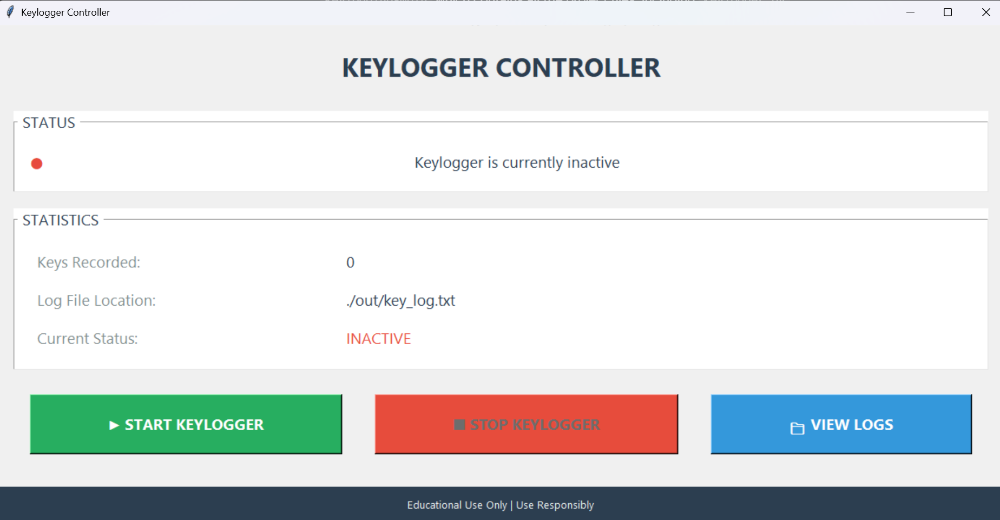
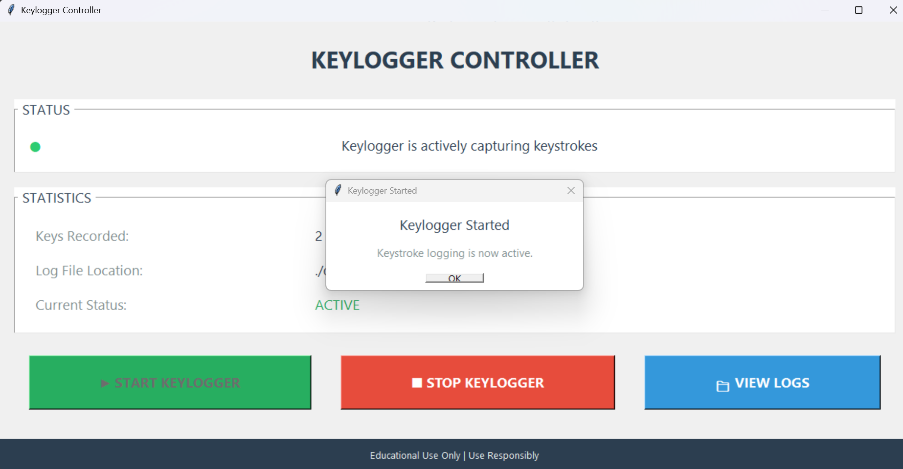
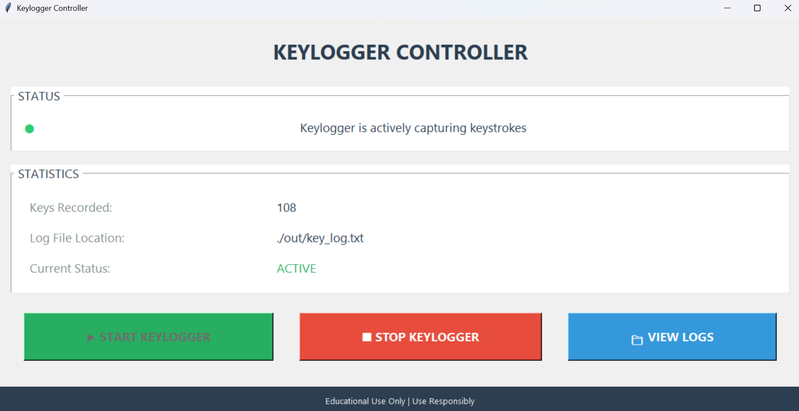
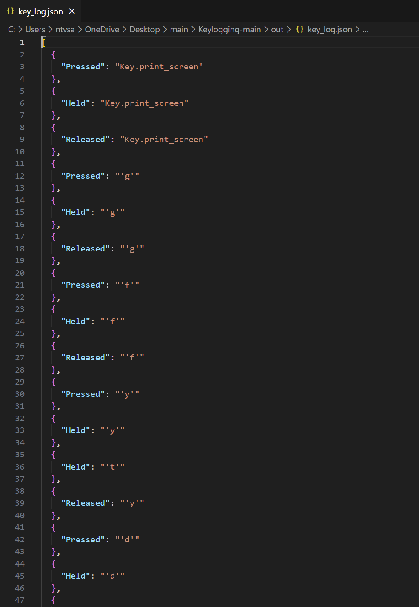

# Keylogging Project

This is a simple yet powerful keylogger application built with Python and Tkinter. It provides a user-friendly graphical interface to start and stop the logging of keystrokes. All captured data is saved locally for educational and monitoring purposes.

> **⚠️ ETHICAL USE ONLY**  
> This software is for **educational** use on systems you **own** or have **explicit, written permission** to monitor. Unauthorized keylogging may be illegal and is a violation of privacy. The authors and contributors assume **no liability** for misuse.

---

## Description

The application captures keyboard events when active and saves them into two separate log files: a plain text file (`key_log.txt`) for easy reading and a structured JSON file (`key_log.json`) for detailed analysis of key presses, holds, and releases. The GUI provides clear status indicators, real-time statistics, and easy controls for managing the keylogging process.

---

## Screenshots

### Controller — Inactive


### Controller — Started (Modal Confirmation)


### Controller — Active (Live Counters)


### JSON Log Example


---

## Features

- **Graphical User Interface**: An intuitive GUI built with Tkinter for easy operation.
- **Start/Stop Controls**: Clear buttons to start and stop the keylogger.
- **Dual Log Formats**: Saves logs in both human-readable `.txt` and machine-readable `.json`.
- **Real-time Status**: Visual indicator shows whether the keylogger is `ACTIVE` or `INACTIVE`.
- **Keystroke Counter**: Displays the total number of key events recorded during a session.
- **Quick Log Access**: A "View Logs" button opens the output directory (`/out`) in your file explorer.
- **Cross-Platform**: Designed to run on Windows, macOS, and Linux.

---

## Requirements

- Python 3.x
- `pynput`

---

## Installation and Usage

1. **Clone or Download** the project.
2. **Install dependencies**:
   ```bash
   pip install -r requirements.txt
